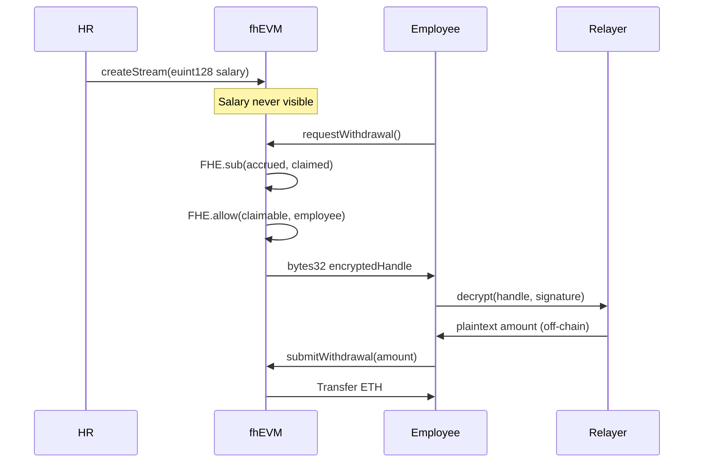

# ZAMACORPS - Privacy-Preserving Payroll System

> **Solving Blockchain's Privacy Problem**: Private salary streaming using Zama's Fully Homomorphic Encryption (FHE)

[](https://docs.zama.ai/fhevm)
[](https://nextjs.org)
[](https://soliditylang.org)
[](LICENSE)

---

## 🚨 The Problem Zama Solves

**Public blockchains expose everything.** Every transaction, every balance, every computation is visible to anyone scanning the chain. This makes blockchain unsuitable for:
- 💰 Confidential financial data (salaries, bonuses)
- 🏥 Private health records
- 🗳️ Secret voting systems
- 🔐 Sensitive business logic

**Traditional "solutions" fail:**
- ❌ **Off-chain storage**: Defeats the purpose of blockchain
- ❌ **Zero-knowledge proofs**: Can't compute on encrypted data
- ❌ **Mixing/privacy coins**: Limited use cases, regulatory issues

## 💡 How Zama's FHE Changes Everything

**Fully Homomorphic Encryption (FHE)** lets you:
- ✅ **Compute directly on encrypted data** - No decryption needed
- ✅ **Maintain privacy on public chains** - Data stays encrypted on-chain
- ✅ **Enable confidential smart contracts** -BusinessLogic runs on ciphertexts

**Example:**
```
Traditional: decrypt(salary) + decrypt(bonus) → exposed values
FHE:        FHE.add(encSalary, encBonus) → still encrypted!
```

---

## 🎯 ZAMACORPS: FHE-Powered Payroll

**What we built:** A fully functional payroll streaming platform where **salaries remain encrypted throughout the entire lifecycle** - from creation to withdrawal.

### How ZAMACORPS Demonstrates Zama's Power

| Traditional Blockchain Payroll | ZAMACORPS with Zama FHE |
|--------------------------------|-------------------------|
| 👀 Salaries visible on-chain | 🔐 Salaries encrypted with `euint128` |
| 🚫 No privacy guarantees | ✅ Mathematically proven privacy (FHE) |
| ⚠️ Regulatory compliance issues | ✅ GDPR/privacy law friendly |
| 📊 Manual batch payments | ⚡ Automated streaming with FHE operations |

### Real-World Impact

**Sector:** Web3 Companies, DAOs, Remote Teams, Creator Economy  
**Pain Point:** Transparent blockchain exposes sensitive financial data  
**Solution:** ZAMACORPS provides mathematically guaranteed privacy

```solidity
// Encrypted salary creation (HR perspective)
euint128 encryptedSalary = FHE.asEuint128(salary);  // Never touches plaintext
streams[employee] = Stream(encryptedSalary, ...);

// Encrypted computation (on-chain)
euint128 accrued = FHE.mul(salaryPerBlock, blocksPassed);  // Computed on ciphertext!
euint128 claimable = FHE.sub(accrued, claimed);            // Still encrypted
```

---

## ✨ Features

### Core FHE Implementation
- 🔐 **End-to-End Encryption**: Client-side encryption → on-chain FHE operations → user-only decryption
- 🧮 **Encrypted Computations**: Salary calculations using `FHE.mul()`, `FHE.sub()`, `FHE.select()`
- 🔑 **Access Control**: `FHE.allow()` grants decryption rights only to authorized users
- 📊 **Verifiable Privacy**: Block explorers show encrypted handles, not salaries

### User Experience
- 🎨 **Professional UI**: ZAMACORPS dark/light theme
- 📈 **Real-time Streaming**: Salaries accrue every block (Sepolia testnet)
- 👥 **Role-Based Access**: Admin, HR, Employee dashboards
- 📤 **Bulk Upload**: CSV import for mass stream creation
- 🔍 **Debug Mode**: Visualize encrypted data flow

---

## 🏗️ Architecture

### Smart Contract (`EncryptedPayrollV2.sol`)
```solidity
contract EncryptedPayrollV2 {
    mapping(address => euint128) withdrawals;  // FHE-encrypted storage
    
    function requestWithdrawal() returns (bytes32) {
        // 1. Compute claimable (encrypted)
        euint128 claimable = FHE.sub(accrued, claimed);
        
        // 2. Store encrypted handle
        withdrawals[msg.sender] = claimable;
        
        // 3. Grant decryption permission
        FHE.allow(withdrawals[msg.sender], msg.sender);
        
        // 4. Return handle for client-side decryption
        return FHE.toBytes32(withdrawals[msg.sender]);
    }
}
```

### Privacy Flow


---

## 🚀 Quick Start

### Prerequisites
- Node.js 18+
- MetaMask wallet
- Sepolia ETH ([Faucet](https://sepoliafaucet.com/))

### Installation
```bash
# Clone repository
git clone https://github.com/Cassxbt/Zamacorps.git
cd Zamacorps

# Install dependencies
cd frontend
npm install

# Run development server
npm run dev
```

Open [http://localhost:3000](http://localhost:3000)

### Live Demo
🌐 **Deployed on Vercel**: [zamacorps.vercel.app](https://zamacorps.vercel.app)

### Contract
- **Network**: Sepolia Testnet
- **Address**: `0x63e9336A8C9B1B9EbF3741a733f4888B91C73549`
- **Explorer**: [View on Basescan](https://sepolia.etherscan.io/address/0x63e9336A8C9B1B9EbF3741a733f4888B91C73549)

---

## 🛠️ Tech Stack

| Component | Technology |
|-----------|------------|
| **Encryption** | Zama fhEVM v0.9, Relayer SDK |
| **Smart Contracts** | Solidity 0.8.24, Hardhat |
| **Frontend** | Next.js 15, React 19, TypeScript |
| **Web3** | wagmi, viem, RainbowKit |
| **Styling** | Tailwind CSS, Framer Motion |

---

## 🧪 Testing

### Smart Contract Tests
```bash
# Navigate to blockchain directory
cd blockchain

# Run comprehensive test suite
npx hardhat test

# Expected output: 11 passing tests covering:
# - Deployment & Access Control
# - HR Role Management
# - Stream Lifecycle (Create/Pause/Cancel)
# - Hook System Integration
```

**Test Coverage:**
- ✅ Role-based access control (RBAC)
- ✅ Stream management logic
- ✅ Hook approval and registration
- ✅ Error handling and edge cases

### Frontend Component Validation
```bash
# Navigate to frontend directory
cd frontend

# Run component integrity tests
npm test

# Validates:
# - FHE module exports (encrypt/decrypt/instance)
# - Contract interaction layer
# - Wagmi configuration
```

---

## 🧪 Testing the FHE Implementation

### 1. Create Encrypted Stream (HR)
```bash
# Navigate to /hr
# Create stream with salary: 0.001 ETH/block
# → Salary encrypted client-side, never visible on-chain
```

### 2. Verify Privacy (Block Explorer)
```bash
# Visit Etherscan contract page
# View "streams" mapping → See encrypted euint128 handle
# NOT the actual salary value ✅
```

### 3. Employee Withdrawal (3-Step Private Flow)
```bash
# 1. requestWithdrawal() → Get encrypted handle
# 2. Decrypt via Relayer (off-chain, user signature required)
# 3. submitWithdrawal(decryptedAmount) → Claim funds
```

**Key Insight**: At no point does the salary appear in plaintext on-chain.

---

## 📂 Project Structure

```
Zamacorps/
├── blockchain/
│   ├── contracts/
│   │   └── EncryptedPayrollV2.sol   # FHE payroll contract
│   ├── scripts/
│   │   └── deploy.ts                 # Deployment script
│   └── hardhat.config.ts
├── frontend/
│   ├── app/
│   │   ├── admin/                    # Role management
│   │   ├── hr/                       # Stream creation (encrypted)
│   │   └── employee/                 # Private withdrawals
│   ├── lib/
│   │   ├── fhe/
│   │   │   ├── encrypt.ts            # Client-side FHE encryption
│   │   │   └── decrypt.ts            # Relayer-based decryption
│   │   └── contracts/
│   │       └── payroll.ts            # Contract interaction layer
└── README.md
```

---

## � Why This Matters for Zama

ZAMACORPS demonstrates **real-world FHE adoption** in a critical vertical:

1. **Payroll is a $1T+ market** with strict privacy requirements
2. **Proves FHE is production-ready** for confidential business logic
3. **Showcases Zama's developer experience** (easy SDK integration)
4. **Enables regulatory compliance** (GDPR, financial privacy laws)

**Beyond Payroll**: This architecture applies to:
- 💰 **Creator Economy**: Private earnings verification
- 📋 **Healthcare**: Encrypted patient records
- 🗳️ **Governance**: Private DAO voting
- 💳 **DeFi**: Confidential credit scores, lending
- 🎮 **Gaming**: Hidden game states, sealed-bid auctions

---

## 🔐 Security & Privacy

- ✅ **No plaintext storage**: All salaries stored as `euint128`
- ✅ **Access control**: `FHE.allow()` restricts decryption to specific addresses
- ✅ **No server-side secrets**: Client-side encryption, user signatures
- ✅ **Auditable privacy**: Block explorers show ciphertexts, not values

---

## � License

BSD-3-Clause-Clear (Zama Compatible)

---

## 💖 Built With Love

**Built with 🩷 by [@cassxbt](https://x.com/cassxbt) for [Zama](https://zama.ai)**

### Author
**cassxbt**  
🐦 Twitter/X: [@cassxbt](https://x.com/cassxbt)  
💼 Building the future of confidential computing on blockchain

---

## 🙏 Acknowledgments

**[Zama](https://www.zama.ai/)** - Making Blockchain Data Private by Default  
📚 **Documentation**: [docs.zama.ai](https://docs.zama.ai)  
🛠️ **fhEVM**: [github.com/zama-ai/fhevm](https://github.com/zama-ai/fhevm)

> *"Zama's FHE unlocks blockchain's true potential by making privacy mathematically guaranteed, not just promised."*

---

**Questions?** Open an issue or reach out to [@cassxbt](https://x.com/cassxbt)
