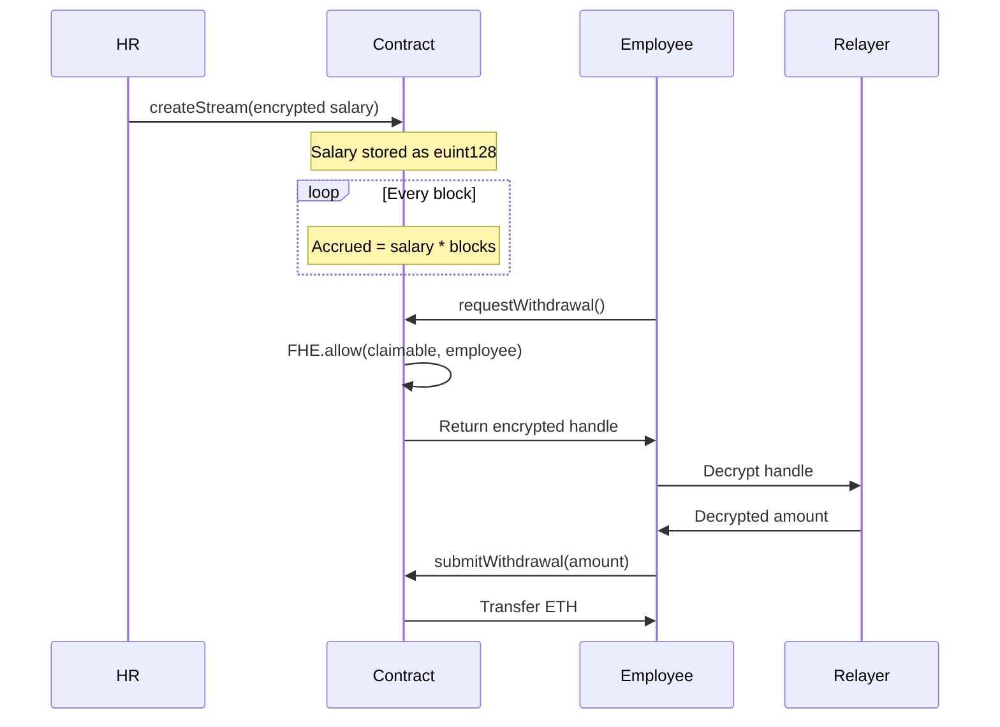

# ZAMACORPS Encrypted Payroll

> Privacy-Preserving Payroll Streaming for Web3 Companies using Zama's Fully Homomorphic Encryption (FHE)

[](https://docs.zama.org)
[](https://nextjs.org)
[](https://soliditylang.org)

## 🎯 Problem

Traditional payroll systems expose sensitive salary data on public blockchains. ZAMACORPS solves this using Zama's Fully Homomorphic Encryption to keep salaries private while maintaining on-chain transparency and automation.

## ✨ Features

- 🔐 **Encrypted Salaries**: Salaries encrypted client-side, never exposed on-chain
- 📊 **Streaming Payments**: Block-based salary streaming with cliff vesting
- 🎭 **Role-Based Access**: Separate dashboards for Admin, HR, and Employees
- 🔍 **Debug Mode**: Visual proof of encryption (see encrypted handles)
- 🎨 **Professional UI**: ZAMACORPS themed with dark/light mode support
- ⚡ **Bulk Upload**: HR can create multiple streams at once

## 🏗️ Architecture

### Smart Contract (`EncryptedPayroll.sol`)
- **FHE Types**: Uses `euint128` for salaries, `euint64` for blocks
- **Privacy Model**: 3-step withdrawal (Request → Decrypt → Submit)
- **Access Control**: `HR_ROLE` for stream creation, `FHE.allow()` for decryption

### Frontend (`Next.js 15 + TypeScript`)
- **Encryption**: Zama Relayer SDK (`@zama-fhe/relayer-sdk`)
- **Wallet**: wagmi + viem for Ethereum interactions
- **UI**: Tailwind CSS + Framer Motion

## 🚀 Quick Start

### Prerequisites
- Node.js 18+
- MetaMask or compatible Web3 wallet
- Sepolia ETH for testing

### Installation

```bash
# Clone repository
git clone <repo-url>
cd onlyfans-benchmark

# Install frontend dependencies
cd frontend
npm install

# Run development server
npm run dev
```

Open [http://localhost:3000](http://localhost:3000)

### Contract Details
- **Network**: Sepolia Testnet
- **Address**: `0xA1B1EBDdc77af1Ec4f18982866332455E0423536`
- **Explorer**: [View on Etherscan](https://sepolia.etherscan.io/address/0xA1B1EBDdc77af1Ec4f18982866332455E0423536)

## 📖 How It Works



## 🧪 Testing Guide

See [Comprehensive Testing Guide](./docs/zama_submission_guide.md) for:
- Privacy verification
- Debug mode walkthrough
- End-to-end withdrawal flow
- Permission control tests
- Error handling checks

### Quick Test

1. **Connect as HR**: Create a stream for any address
2. **Connect as Employee**: View encrypted salary in Debug Mode
3. **Wait 10 blocks**: Then withdraw to see the 3-step flow

## 🛠️ Tech Stack

| Layer | Technology |
|-------|-----------|
| Smart Contract | Solidity 0.8.24, Zama FHEVM v0.9 |
| Frontend | Next.js 15, React 19, TypeScript |
| Styling | Tailwind CSS, Framer Motion |
| Web3 | wagmi, viem, MetaMask |
| Encryption | @zama-fhe/relayer-sdk |

## 📂 Project Structure

```
onlyfans-benchmark/
├── blockchain/
│   ├── contracts/
│   │   └── EncryptedPayroll.sol    # Main FHE contract
│   ├── scripts/
│   │   └── deploy.ts                # Deployment script
│   └── hardhat.config.ts
├── frontend/
│   ├── app/
│   │   ├── page.tsx                 # Homepage
│   │   ├── admin/page.tsx           # Admin dashboard
│   │   ├── hr/page.tsx              # HR dashboard
│   │   └── employee/page.tsx        # Employee dashboard
│   ├── components/
│   │   ├── hr/
│   │   │   ├── CreateStreamForm.tsx
│   │   │   └── BulkUpload.tsx
│   │   └── employee/
│   │       └── WithdrawPanel.tsx    # 3-step withdrawal UI
│   └── lib/
│       ├── fhe/
│       │   ├── instance.ts          # FHE SDK setup
│       │   ├── encrypt.ts           # Client-side encryption
│       │   └── decrypt.ts           # Client-side decryption
│       └── contracts/
│           └── payroll.ts           # Contract wrapper
```

## 🎥 Demo

[Demo Video Link] - Coming Soon

## 🔐 Security Considerations

- ✅ Salaries never stored in plaintext on-chain
- ✅ Access control via OpenZeppelin's `AccessControl`
- ✅ FHE.allow() restricts decryption to specific users
- ✅ No re-entrancy vulnerabilities (single transfer per withdrawal)
- ⚠️ Contract does not support stream cancellation (future feature)

## 🌟 Zama FHE Usage

### Key FHE Operations
1. **Encryption**: `instance.createEncryptedInput().add128(salary)`
2. **Conditional Logic**: `FHE.select(isPastCliff, accrued, 0)`
3. **Access Control**: `FHE.allow(claimable, employee)`
4. **Decryption**: `instance.decrypt(handle, userAddress)` via Relayer

### Privacy Guarantees
- HR can create streams without revealing salaries to the public
- Employees can only decrypt their own claimable amounts
- Block explorers show encrypted handles, not plaintext values

## 🚀 Deployment

### Frontend (Vercel)
```bash
# Push to GitHub
git push origin main

# Import to Vercel
# Set environment variable:
NEXT_PUBLIC_PAYROLL_ADDRESS=0x1cD2d67ab3Cb3e35F14c7907b9f5CF8dB1AC38Da
```

### Contract (Already Deployed)
The `EncryptedPayroll` contract is deployed on Sepolia. To redeploy:
```bash
cd blockchain
npx hardhat run scripts/deploy.ts --network sepolia
```

## 📝 License

BSD-3-Clause-Clear (Zama Compatible)

## 🙏 Acknowledgments

Built with [Zama FHEVM](https://docs.zama.org) - Making Blockchain Data Private by Default

---

**For Judges**: See [Testing Guide](./docs/zama_submission_guide.md) for detailed evaluation instructions.
